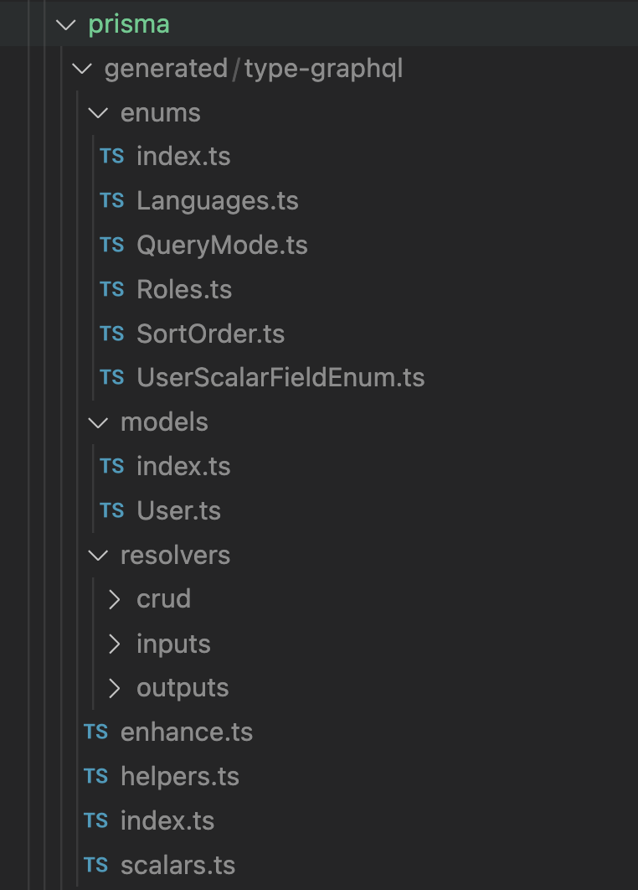

# Project Orientation

Let's take a quick tour through the files included in this project boilerplate. At the root of the repository you have a `package.json` file containing the dependencies for testing and linting. From there, the code is split into a `frontend` and a `backend` directory.

## Backend Organization

Since this workshop is targeted at Frontend Developers, we will start with a quick overview of the backend code structure, as that will probably require a bit more explanation.

### Prisma Schema

Since Prisma is going to do all of the heavy lifting for us when it comes to making our server and database work, let's start there. All of the Prisma related assets are located in the `backend/prisma` directory. Let' open up `prisma/schema.prisma` and take a look.

We'll go through the code blocks one-by-one to get an idea of what each one is doing.

For more detailed information, see the [Prisma Schema Docs](https://www.prisma.io/docs/concepts/components/prisma-schema).

#### Datasource

The datasource block is used to give Prisma information about the type of database we are using and where to find that database. We are going to use a Postgres database and that database will be running at the address stored in the `DATABASE_URL` environment variable. We will provide this environment variable via docker-compose for development, and store it in Heroku for production.

```js title=backend/prisma/schema.prisma
datasource db {
  provider = "postgresql"
  url = env("DATABASE_URL")
  shadowDatabaseUrl = env("SHADOW_DATABASE_URL")
}
```

_**NOTE**: `SHADOW_DATABASE_URL` stores the address of a second database for Prisma to perform migrations. We do not need this variable for local development. But we will need it later when we deploy to Heroku._

[Prisma's Datasource Docs](https://www.prisma.io/docs/concepts/components/prisma-schema/data-sources)

#### Generators

Generator blocks tell prisma which assets it should generate when we run the command `prisma generate`. There can be multiple generator blocks, each one will output different assets.

The Prisma Client is the API between the developer and GraphQL. For Prisma to work, we have to generate a Client. The `provider` property defines the language to use when generating the assets. The `binaryTargets` property is to define which operating system is running on the host machine. Prisma keeps [a list of supported operating systems](https://www.prisma.io/docs/reference/api-reference/prisma-schema-reference#binarytargets-options).

Since we are building docker based on the alpine linux base image, we going to use the `"linux-musl"` target. Later on when we run `prisma generate`, just ignore the warning about not building for the current operating system. We will only run the server inside of docker or on heroku, so we don't need the Client built for our machine.

Once we have our Prisma Client, we are going to add a generator for TypeGraphQL. This generator will automatically generate type-safe CRUD and Relations GraphQL resolvers for us. But there are numerous other generators we could use kept in a [list in the Prisma docs](https://www.prisma.io/docs/concepts/components/prisma-schema/generators#community-generators).

```js title=backend/prisma/schema.prisma
generator client {
  provider = "prisma-client-js"
  binaryTargets = ["linux-musl"]
}

generator typegraphql {
  provider = "typegraphql-prisma"
  output   = "./generated/type-graphql"
}
```

For general information about configuring Prisma generators, take a look at the [official Prisma generator docs](https://www.prisma.io/docs/concepts/components/prisma-schema/generators). To learn more about our specific generator, check out the [TypeGraphQL generator docs](https://prisma.typegraphql.com/docs/basics/configuration).

#### Models and Enums

After defining the `datasource` and `generator` options for Prisma, we write the actual models for our data. Prisma uses these models to generate tables in the database, and define types for GraphQL.

[Prisma Models Docs](https://www.prisma.io/docs/concepts/components/prisma-schema/data-model)

### Generate Prisma Assets

Now that we have seen the configuration for Prisma, let's use Prisma to generate the assets needed to run our server. Open up a terminal inside of the `backend` directory and run:

```sh
 yarn  build
 ```
 
 This command will execute `prisma generate`, which tells Prisma to execute the `generator` blocks that we looked at previously. The first `generator` block will create an importable Prisma Client inside at `node_modules/@prisma/client` which we use to initialize our server. This Client is customized based on the schema we defined in `schema.prisma`.

The second `generator` block will create a large chunk of the GraphQL assets needed for interacting with our server. If you look inside `backend/prisma/generated/type-graphql` you will find the resolvers and type definitions which we will use for generating and querying our GraphQL schema.



### Prisma Context

We have sucessfully generated our Prisma Client. So how do we use it? Open up the file located `prisma/context.ts`. Here we `import  { PrismaClient } from @prisma/client`. This is the Client we generated in the previous step.

The whole initialization logic is a bit complicated to allow for smooth operation during development, but in the middle of all that we instantiate a `new PrismaClient()` and export it.

We will use this client, in combination with our GraphQL Schema, to setup our Apollo GraphQL Server.

### GraphQL Schema

Before we get to the code for our server, we have to look at the GraphQL Schema. So, open up `backend/src/graphql/schema.ts`. Inside, you will see that we use the `buildSchema` function from `type-graphql` and the `resolvers` generated by Prisma and TypeGraphQL.

For more information about the resolvers that are generated, refer to the [TypeGraphQL Usage Docs](https://prisma.typegraphql.com/docs/basics/usage#crud-resolvers).

You don't have to have experience defining GraphQL schemas to see, this is easy.

### Apollo Server

Alright, so far we have seen how we define our Prisma Schema, we used Prisma to generate the Client and GraphQL assets, we created an instance of Prisma Client and we defined a GraphQL Schema.

Now it's time to see how the Prisma Client and GraphQL schema are used to start our Apollo GraphQL Server. Open up the file at `backend/src/app.ts`.

The code in this file is a slightly modified version of the code found on the [Official Apollo Server Docs](https://www.apollographql.com/docs/apollo-server/integrations/middleware/#apollo-server-express).

Compared with the example code, we omit the `typedefs` and `resolvers` properties, in favor of `schema` and `context`. If you remember from the GraphQL schema file, we passed our `resolvers` (generated by Prisma) there and those resolvers make use of the Prisma Context.

For more information, see [the docs about configurating Apollo Server](https://www.apollographql.com/docs/apollo-server/api/apollo-server).

Finally, we import `app.ts` inside of `index.ts` and start our server.
