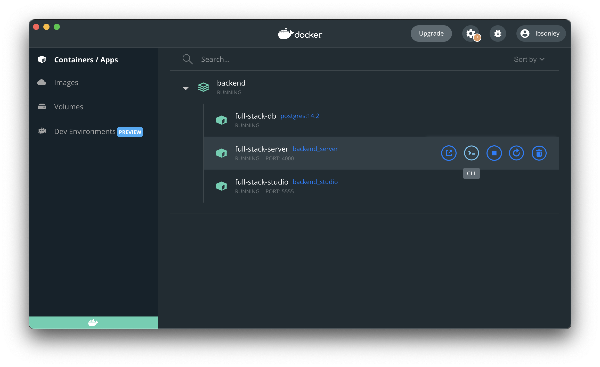
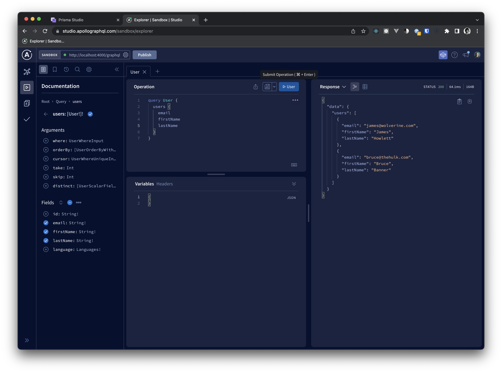
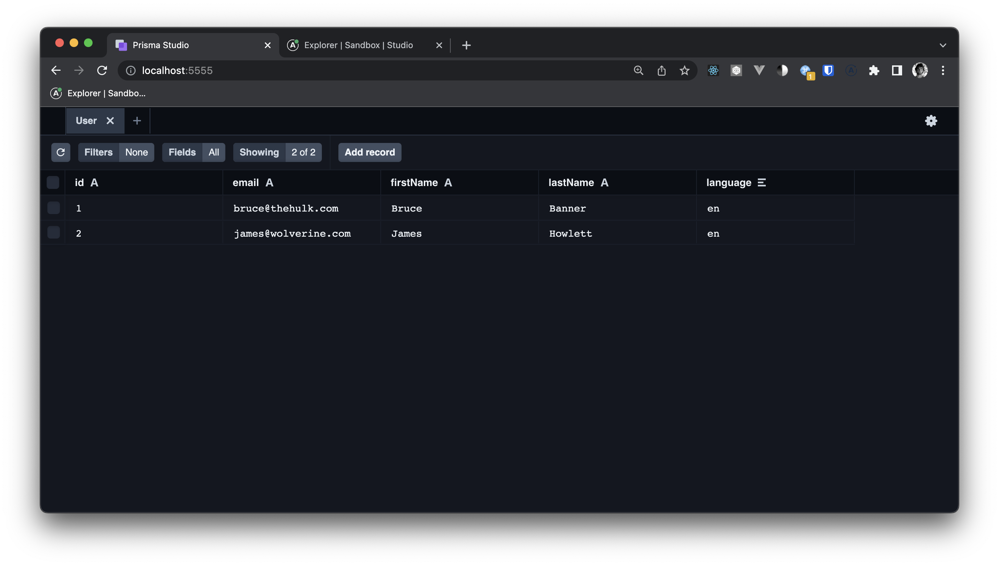

# Run Local Server and Database

The repository is setup to run our Apollo GraphQL Server and Postgres database in a docker container for local development.

## Dockerfile and docker-compose.yml

Before we run Docker, let's take a look at the `Dockerfile` and `docker-compose.yml` to get a sense of what going on.

TODO -> Explain Docker configs

## Start Docker Container

To start the docker container, open a terminal in the `backend` directory of the repository and run the following commands.

```sh
# build the docker container
docker-compose build

# run the docker container
docker-compose up -d
```

The first time you start the docker containers, the databases will be empty. There are a couple of steps you need to take to apply the Prisma Schema to the database. First, you will need to create tables on the database for each model. Next, you will want to fill the database with some sample data.

### Apply Database Migrations

Up until now, we have not really interacted with our Database. In fact, we haven't even had a running database. But now that our database is running inside of Docker, we can start adding data.

To do this, open a terminal inside of the "server" docker container.



Once inside the container, run the command to create tables defined in the prisma schema on the database:

```sh
yarn prisma migrate deploy
```

This should have created the `Users` tables on the database.

### Seed Prisma Database

Now that the `Users` tables exists. We can add some sample data to our database. Prisma comes with a `db seed` command that does exactly that. Inside of the server container terminal, run the command to add the seed data.

```sh
yarn prisma db seed
```

This command will look inside of `backend/package.json` for a `prisma.seed` property and execute the command defined there. Our `package.json` defines this command as `ts-node prisma/seed/index.ts`.

If we take a look inside of that file, we will see that we import some sample data from `prisma/seed/data/users.ts`. We also create a Prisma Client instance. We then loop through that data, calling `prisma.user.create()` for each user.

For more information about seeding data, see the [Prisma Seed Docs](https://www.prisma.io/docs/guides/database/seed-database)


## Explore Dev Tools

Apollo Server comes with its own API explorer called Apollo Studio. You can see it by opening [http://localhost:4000/graphql](http://localhost:4000/graphql) in your browser.



Prisma also comes with its own database explorer tool called Prisma Studio. You can see it by opening [http://localhost:5555](http://localhost:5555) in your browser.


